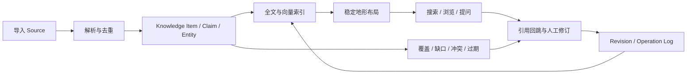
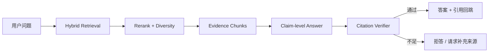
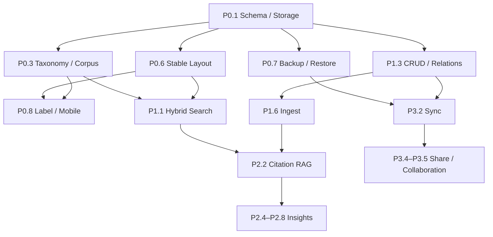

# Cognitive Terrain 成熟产品计划

> 状态：后续成熟化路线图；Schema v3 第一阶段多对象物化已实现，真实来源库、完整 Citation/Revision、引用式 RAG、同步等仍未实现
>
> 基线：2026-08-15，分支 `codex/semantic-terrain-foundation`；Issue 路线图见 [#9](https://github.com/cat0825/cognitive-terrain/issues/9)
>
> 关联文档：`RELEASE-PLAN.md` 负责“公开 Demo 如何发布”；本文负责“如何从 Demo 变成成熟 AI Infra 知识产品”
> 规划口径：1 名高级前端/数据工程师 + 0.5 名内容研究人员；预计 12–17 周。单人同时承担内容整理时，预计 16–22 周。

---

## 1. 结论

Cognitive Terrain 当前已经是一个完成度较高的可发布 Demo：全屏 3D 地形、时间演化、密集知识点、项目导入导出、本地 embedding、项目库和基础测试链路都已成立。

它还不是成熟知识库。最关键的原因不是视觉，而是地形背后的知识对象不可信、不可追溯，也无法完成“采集 → 组织 → 检索 → 引用 → 更新 → 恢复”的工作闭环：

1. 当前 1800 个 AI Infra 点由模板生成，不是 1800 篇可核验文章。
2. 每个点只有 Note 级字段，缺来源、引用、实体、关系、版本和分类体系。
3. 搜索是字符串包含匹配，无法承担知识发现。
4. 编辑一条笔记会重新 embedding 并全量 UMAP，已有山丘可能漂移。
5. IndexedDB 已有项目表与本地恢复点表，可恢复覆盖或误删的项目；但清站点数据会同时删除二者，迁移回滚和站点外自动备份仍未成立。
6. 地形是当前唯一强视图，尚缺结果列表、来源库、Inbox、关系视图和引用式问答。

因此，后续不应继续堆叠视觉效果。正确顺序是：

**可信数据地基 → 完整知识工作流 → 引用式 AI → 同步、权限与运行保障。**

---

## 2. 产品目标

### 2.1 一句话定义

一个以来源为依据、以 AI Infra 为领域骨架、以认知地形为主要空间视图的本地优先知识库。

### 2.2 核心用户任务

用户必须能独立完成以下闭环：

1. 导入网页、PDF、论文、GitHub 仓库或本地笔记。
2. 看清来源是否可靠、何时发布、哪些结论由哪段原文支持。
3. 用关键词、语义、分类、实体、时间和来源组合检索。
4. 在地形中识别热点、孤岛、缺口、冲突和过期区域。
5. 新建、编辑、关联、批量整理、删除、撤销和恢复内容。
6. 向知识库提问，并逐句跳回证据。
7. 在数据增长后保持地形稳定，不因新增少量内容导致山丘整体换位。
8. 在离线、升级、浏览器清理或换设备时仍能恢复数据。

### 2.3 产品边界

- 地形是知识库的主视图之一，不是数据本体。
- 一个点默认对应一个可打开的 `KnowledgeItem`，AI Infra 预置库中默认对应一篇文章、论文、文档页或项目。
- 每个点必须能追溯到至少一个 `Source`；没有来源的内容显示为用户草稿，不混入“已核验知识”。
- 山丘可以由语义聚类生成，但必须叠加稳定 taxonomy，并允许用户查看“为何属于这里”。
- AI 只输出带证据的回答；证据不足时明确拒答。
- P0–P2 保持本地优先。账号、同步和协作在 P3 引入，不能阻塞单机使用。

---

## 3. 当前能力与现场证据

### 3.1 已具备

| 能力 | 当前实现 | 判断 |
| --- | --- | --- |
| 3D/2D 地形 | Three.js / React Three Fiber，等高线、峰、点、时间演化 | Demo 强项 |
| AI Infra 演示图 | 30 个主题、每主题 60 个点，共 1800 条 | 视觉成立，内容不可信 |
| 本地分析 | Transformers embedding，失败时确定性向量降级 | 可用基线 |
| 项目操作 | 导入、合并、编辑、项目库、改名、删除、导出、项目级恢复点 | 有项目级恢复闭环，缺条目级修订与回收站 |
| 时间与对比 | 时间轴、播放、快照比较 | 已形成差异化 |
| 性能处理 | Worker、动态加载模型、质量档位、性能脚本 | 适合继续演进 |
| 测试 | unit、E2E、visual、a11y、perf、size | 有工程基础 |

### 3.2 代码审计证据

| 证据 | 当前事实 | 影响 |
| --- | --- | --- |
| `src/domain/types.ts:1` | Schema v2 主要只有 Note、Peak、Snapshot、Project | 无法表达来源、引用、实体、关系、修订 |
| `src/domain/demo.ts:15`、`:307` | `30 × 60` 条内容按模板生成 | 点不是实际文章，无法用于知识判断 |
| `src/domain/project-view.ts:3` | 搜索对标题、正文、标签做 lowercase substring | 无排序、模糊匹配、字段权重或语义召回 |
| `src/store/app-store.ts:203` | 合并和编辑都调用完整 `startAnalysis` | 小改动也会触发全量计算 |
| `src/pipeline/layout.ts:22` | 每次对全部向量重新运行 UMAP | 已有地形缺位置稳定承诺 |
| `src/pipeline/neighbors.ts:10` | 每条笔记与全部笔记比较并完整排序 | 近似 `O(n² log n)`，无法直接扩到 50k |
| `src/storage/db.ts:4` | IndexedDB 有 `projects` 与 `backups`，单项目保留 8 个恢复点 | 恢复点仍在同一站点数据内；缺条目级修订、回收站、站点外备份和迁移回滚 |
| `tests/a11y/accessibility.spec.ts:4` | 主流程主动关闭 `color-contrast` 规则 | 不能宣称完整 WCAG 2.2 AA |
| `tests/e2e/smoke.spec.ts:3` | E2E 覆盖加载、导入和项目恢复点 | 未覆盖编辑、删除后恢复、迁移、大数据和故障路径 |

### 3.3 运行态体验审计

审计环境：Chromium，`1440 × 960` 与 `390 × 844`，真实打开 `http://127.0.0.1:4174/`；页面控制台 0 error。

| 问题 | 现场结果 | 优先级 |
| --- | --- | --- |
| 桌面峰标签投影错误 | 约 30 个 `.peak-label` 位于视口左侧之外，画面只残留截断文字 | P0 |
| 移动端标签拥挤 | 同屏出现大量标签，存在明显重叠和阅读竞争 | P0 |
| 默认详情遮挡地图 | 首条笔记默认选中；桌面中央详情卡遮住主要山体 | P0 |
| 移动端详情占比过高 | 详情面板约占 370 × 220，和底部时间轴同时挤压地图 | P0 |
| 首启引导遮挡核心体验 | 首屏大面积覆盖地形，移动端尤其明显 | P0 |
| 操作发现性不足 | 全屏模式简洁，但新建、浏览、来源、关系等入口不存在 | P1 |
| 无非空间浏览路径 | 用户无法切换到来源表、结果列表、Inbox 或分类目录 | P1 |

成熟版本仍保持“地形铺满全屏”，但通过按需抽屉、命令面板和底部 sheet 提供工作流，不恢复固定的大块侧栏。

---

## 4. 成熟产品基线

竞品不是要求逐项照抄，而是定义用户已经形成的最低预期。

| 产品基线 | 已成熟能力 | Cognitive Terrain 应吸收的原则 |
| --- | --- | --- |
| Obsidian | 双链、反链、本地 Graph、属性、插件、同步与发布 | 图必须支持导航、编辑和重构，不能只是展示 |
| Heptabase | 卡片、白板、空间组织、主题学习工作流 | 空间位置应服务知识整理，视图和内容编辑要互通 |
| Capacities | 类型化对象、属性、集合、查询 | 知识对象需要明确类型和可查询字段 |
| NotebookLM | 基于用户来源的问答、引用回跳、来源管理 | AI 回答必须逐句落到证据 |
| InfraNodus | 聚类、网络结构、缺口和研究问题发现 | 可视化要产出可行动洞察，而非只显示相似度 |

### 4.1 成熟度等级

- `L0`：不存在
- `L1`：演示可用
- `L2`：个人日常可用
- `L3`：可靠、可恢复、可度量
- `L4`：成熟产品能力

| 维度 | 当前 | P2 目标 | P3 目标 | 最大差距 |
| --- | ---: | ---: | ---: | --- |
| 地形视觉与交互 | L2 | L3 | L4 | 标签 LOD、移动端、可解释聚类 |
| AI Infra 内容可信度 | L1 | L4 | L4 | 真实来源、引用、审核与更新 |
| 知识数据模型 | L1 | L4 | L4 | Source/Entity/Relation/Citation/Revision |
| 采集与导入 | L1 | L3 | L4 | Web/PDF/GitHub/arXiv/RSS/Obsidian |
| CRUD 与整理 | L1 | L4 | L4 | 新建、删除、回收站、批量、双链、Inbox |
| 搜索与发现 | L1 | L4 | L4 | 全文、语义、混合排序、保存查询 |
| 引用式 AI | L0 | L3 | L4 | RAG、引用校验、拒答、知识洞察 |
| 数据耐久与恢复 | L1 | L3 | L4 | 自动备份、版本历史、灾难恢复 |
| 性能与大数据 | L2 | L3 | L4 | 增量布局、ANN、10k/50k 门禁 |
| 无障碍与移动端 | L1 | L3 | L4 | 对比度、键盘、替代视图、触控布局 |
| 同步、分享与协作 | L0 | L0 | L3 | 身份、权限、冲突、加密同步 |
| 监控、安全与运营 | L0 | L2 | L3 | 发布回滚、故障遥测、隐私设置 |

---

## 5. 目标信息架构

### 5.1 用户可见视图

| 视图 | 作用 | 首发阶段 |
| --- | --- | --- |
| Terrain | 语义地形、峰、时间、覆盖率、差异 | 已有，P0 加固 |
| Search | 混合搜索结果、筛选、排序、保存查询 | P1 |
| Library | 文章、论文、项目、来源的表格/列表 | P1 |
| Inbox | 待分类、待读、待核验内容 | P1 |
| Source Inspector | 来源元数据、原文片段、引用、许可、抓取状态 | P0 |
| Relations | 双链、实体关系、证据路径 | P1 |
| Ask | 带逐句引用的问答与研究记录 | P2 |
| Coverage | taxonomy 覆盖、知识缺口、过期与冲突 | P2 |
| Settings | 模型、隐私、备份、同步、存储和性能 | P0/P3 |

### 5.2 主循环



---

## 6. Schema v3

### 6.1 设计原则

1. 原始来源、用户知识、算法派生结果分层存储。
2. 每个派生字段带 `provenance`、版本和生成时间。
3. 搜索索引、embedding、地形网格都可重建，不作为唯一真相。
4. 所有用户编辑形成 revision；所有 destructive action 可撤销。
5. ID 与内容 hash 分开，内容变化不能让对象身份消失。
6. 导出格式有明确版本、迁移器和完整性 hash。

### 6.2 核心对象

```ts
type Id = string

interface WorkspaceV3 {
  schemaVersion: 3
  id: Id
  name: string
  createdAt: string
  updatedAt: string
  taxonomyVersion: string
  activeLayoutId: Id
  settings: WorkspaceSettings
}

interface Source {
  id: Id
  kind: 'web' | 'pdf' | 'paper' | 'github' | 'rss' | 'note'
  canonicalUrl?: string
  title: string
  authors: string[]
  publisher?: string
  publishedAt?: string
  retrievedAt: string
  contentHash: string
  language: string
  license?: string
  authority: 'primary' | 'official' | 'engineering' | 'community' | 'unknown'
  ingestStatus: 'queued' | 'ready' | 'partial' | 'failed'
}

interface KnowledgeItem {
  id: Id
  kind: 'article' | 'paper' | 'documentation' | 'project' | 'concept' | 'note'
  title: string
  summary?: string
  primarySourceId?: Id
  sourceIds: Id[]
  taxonomyNodeIds: Id[]
  entityIds: Id[]
  status: 'inbox' | 'active' | 'read' | 'archived' | 'draft'
  trust: 'verified' | 'reviewed' | 'unreviewed' | 'draft'
  createdAt: string
  updatedAt: string
  revision: number
}

interface Citation {
  id: Id
  itemId: Id
  sourceId: Id
  quote: string
  locator: {
    page?: number
    section?: string
    startOffset?: number
    endOffset?: number
    fragmentUrl?: string
  }
  capturedAt: string
  contentHash: string
}

interface Entity {
  id: Id
  kind: 'technology' | 'company' | 'project' | 'model' | 'hardware' | 'person'
  name: string
  aliases: string[]
}

interface Relation {
  id: Id
  fromId: Id
  predicate: string
  toId: Id
  citationIds: Id[]
  confidence: number
  provenance: 'user' | 'import' | 'model'
  validFrom?: string
  validTo?: string
}

interface Revision {
  id: Id
  entityId: Id
  entityType: string
  parentRevisionId?: Id
  patch: unknown
  actorId: Id
  createdAt: string
}
```

实现时还需定义：

- `TaxonomyNode`：稳定领域 ID、父子关系、别名、描述、版本。
- `Collection` / `SavedQuery`：静态集合与动态查询。
- `EmbeddingRecord`：模型、维度、内容 hash、量化方式。
- `LayoutRecord`：坐标、所属 cluster、布局算法、anchor 版本。
- `Operation`：撤销、重做、同步和恢复所需操作日志。
- `ContentChunk`：引用与 RAG 的最小证据单元。

### 6.3 点与山丘的不变量

- 一个可交互点必须对应一个 `KnowledgeItem`。
- 预置 AI Infra 地图中，`KnowledgeItem.primarySourceId` 必填。
- 点的 tooltip 必须显示标题、来源类型、发布日期、可信等级和所属 taxonomy。
- 山丘的稳定身份来自 taxonomy 或持久化 cluster ID，不能只用某次 UMAP 的临时序号。
- 山丘高度由可解释指标组成：内容密度为主，可叠加质量、活跃度或用户权重；UI 必须显示当前高度口径。
- 自动聚类与人工 taxonomy 不一致时保留二者：位置表达语义，边界/标签表达领域骨架。

### 6.4 Schema v3 / IndexedDB v5 存储布局

截至 2026-08-14，IndexedDB v5 已将兼容项目原子物化为 Workspace、Item、Source、Relation、CognitiveState、InteractionEvent、PlateMembership、Layout、TerrainProfile、Citation 和 Revision stores。对象使用 workspace 复合键隔离；Citation 对旧数据为空，Revision 仅记录 content/entity hash 基线。TaxonomyNode、Entity、Embedding、Operation、完整 revision patch 和 backup manifest 仍按下表后续补齐。

| Object Store | 主键 / 索引 |
| --- | --- |
| `workspaces` | `id`，`by-updated-at` |
| `sources` | `id`，`by-canonical-url`，`by-content-hash`，`by-published-at` |
| `items` | `id`，`by-workspace`，`by-status`，`by-updated-at` |
| `citations` | `id`，`by-item`，`by-source` |
| `entities` | `id`，`by-normalized-name` |
| `relations` | `id`，`by-from`，`by-to`，`by-predicate` |
| `taxonomy` | `id`，`by-parent`，`by-version` |
| `revisions` | `id`，`by-entity`，`by-created-at` |
| `embeddings` | `[modelId, contentHash]` |
| `layouts` | `[layoutId, itemId]`，`by-cluster` |
| `operations` | `sequence`，`by-workspace`，`by-sync-state` |

大体积 PDF、抓取正文和备份快照优先放 OPFS；IndexedDB 保存元数据和引用。搜索索引视为缓存，可从对象仓重建。

---

## 7. AI Infra 内容体系

### 7.1 Taxonomy v1

| ID | 一级山系 | 覆盖范围 |
| --- | --- | --- |
| `hardware` | 加速器与硬件系统 | GPU/TPU/NPU、HBM、互联拓扑、服务器设计 |
| `kernels` | 算子与 Kernel | CUDA、Triton、FlashAttention、融合、稀疏算子 |
| `compiler-runtime` | 编译器与 Runtime | XLA、TorchInductor、TVM、执行图、算子调度 |
| `networking` | 集群网络与通信 | RDMA、InfiniBand、RoCE、NCCL、collective |
| `storage-data` | 存储与数据管线 | 对象存储、checkpoint、数据加载、缓存、shuffle |
| `orchestration` | 调度与资源管理 | Kubernetes、Slurm、GPU Operator、队列、多租户 |
| `training` | 分布式训练 | DP/TP/PP/EP、ZeRO/FSDP、混合精度、容错 |
| `inference` | 推理与 Serving | batching、KV cache、量化、投机解码、PD 分离 |
| `model-systems` | 模型系统协同 | MoE、长上下文、多模态、稀疏计算 |
| `platform-sre` | 平台工程与 SRE | 可观测性、容量、成本、可靠性、发布 |
| `security-governance` | 安全与治理 | 供应链、隔离、隐私、合规、模型访问控制 |
| `agent-infra` | Agent Infra | runtime、sandbox、memory、tooling、eval、harness |

每个一级山系应拆成 4–10 个二级主题。taxonomy 使用稳定 slug 和版本号，改名不能改变 ID。

### 7.2 来源等级

| 等级 | 来源 | 使用规则 |
| --- | --- | --- |
| S1 | 官方文档、标准、论文、项目仓库、芯片厂商资料 | 可作为核心事实依据 |
| S2 | 具名工程团队技术博客、会议演讲、公开 benchmark | 可作为实践与性能依据，保留环境条件 |
| S3 | 高质量社区文章、课程、访谈 | 用于解释和线索，不作为唯一关键证据 |
| S4 | 未核验转述、AI 生成文本 | 默认 Inbox，不进入“已核验”覆盖率 |

### 7.3 首个真实知识包

P0 用真实元数据替换模板 Demo，目标不是立即写 1800 篇长文，而是让每个点都真实：

- 至少 300 个可访问、去重后的真实来源点。
- 12 个一级山系全部有覆盖，每个至少 15 个来源点。
- S1 + S2 占比至少 80%，S4 不得进入默认地图。
- 100% 有标题、canonical URL、来源类型、抓取时间和 taxonomy。
- 至少 95% 有发布日期；至少 80% 有作者或发布组织。
- 100% 点可从详情打开来源；失效链接率低于 2%。
- 只保存必要元数据、短摘要和引用片段，不默认镜像受版权保护的全文。
- 内容更新采用 manifest + hash，CI 每周检查链接、重复、taxonomy 覆盖和时间新鲜度。

---

## 8. 技术架构决策

### 8.1 增量布局

禁止在普通编辑、导入和删除时直接重跑全量 UMAP。

默认流程：

1. 只对内容 hash 变化的 item 重新 embedding。
2. 用 ANN 找到新点的语义近邻。
3. 新点以近邻加权重心作为初始坐标。
4. 仅对新点和局部邻域做有限步松弛，已有点作为 anchor。
5. 峰和网格只重算受影响 tile。
6. 保存 `LayoutRecord` 和 drift 指标。

显式“重新布局”才允许全量 UMAP。全量布局后用 Procrustes 对齐旧坐标并提供预览、确认和回滚。

稳定性门槛：

- 导入不超过现有数据 5% 的新内容时，旧点位置漂移 p95 ≤ 0.015（归一化坐标）。
- 任一旧点漂移 ≤ 0.05；超过时阻止自动提交并提示重新布局。
- taxonomy 主峰的屏幕象限在普通增量导入后保持不变。

### 8.2 近邻索引

当前全量比较替换为 Worker 内 ANN 索引：

- 10k 以下允许向量块扫描作为兼容路径。
- 10k 以上使用 HNSW；索引按 embedding model 和 content hash 版本化。
- 删除使用 tombstone，空闲时 compact。
- ANN 召回通过固定评测集验证，Recall@10 ≥ 0.95。
- 坐标距离不再代表语义近邻真相，只用于画面交互。

具体库在 P0 spike 中从浏览器 HNSW 实现与 SQLite/wasm 向量扩展二选一；选择标准是 Chromium/Safari 兼容、索引持久化、包体、50k 延迟和维护活跃度。未通过门槛不进入主分支。

### 8.3 混合搜索

P1 搜索管线：

1. 解析查询、过滤器和领域别名。
2. 全文召回：标题、正文、实体、taxonomy、作者分字段加权。
3. 语义召回：query embedding + ANN。
4. 合并：RRF 作为默认，避免依赖不可解释的手调绝对分数。
5. 可选 rerank：只处理前 40 条。
6. 输出匹配片段、命中字段、排序原因和来源可信度。

要求：

- 搜索在独立 Worker 中运行。
- 中文和英文都支持；AI Infra 缩写词典处理 `TP`、`PP`、`FSDP`、`PD` 等歧义。
- 结果可以一键定位地形，也可以在列表中连续浏览。
- 建立至少 100 条人工标注查询集；NDCG@10 ≥ 0.75，MRR@10 ≥ 0.80。

### 8.4 引用式 RAG



约束：

- 检索单元是带 source locator 的 `ContentChunk`。
- 每个事实句必须关联 citation；UI 点击直接打开原文位置。
- 引用校验失败的句子不得静默展示。
- 导入文本视为不可信数据，防止 prompt injection 改写系统规则。
- 云端模型是可选 provider；发送前显示数据范围。支持本地模式或 BYOK，不把 API key 明文写入 IndexedDB。

### 8.5 渲染与标签

- 点使用 instancing；不可为每个知识点创建常驻 React DOM。
- 标签分三级 LOD：山系 → 主题 → 单点；根据缩放、重要度和选择态切换。
- 使用屏幕空间碰撞检测和预算：桌面默认最多 24 个峰标签，移动端最多 10 个。
- 标签必须经过 viewport clamp；离屏对象不保留可聚焦 DOM。
- 移动端详情改为可收起 bottom sheet，时间轴在 sheet 展开时自动进入紧凑模式。
- 默认不选择首条笔记；只有用户点击或搜索定位后打开详情。
- 2D 列表/等高线是键盘、低性能和无 WebGL 环境的完整替代路径。

---

## 9. P0：可信地基

**周期：2–3 周**

**目标：任何一个点都能回答“它是什么、来自哪里、为何在这里、改坏了如何恢复”。**

### 9.1 范围

| ID | 工作项 | 交付物 |
| --- | --- | --- |
| P0.1 | Schema v3 与迁移 | v1/v2 → v3 migration、fixture、完整性校验、回滚包 |
| P0.2 | 多对象仓存储 | Source/Item/Citation/Taxonomy/Revision/Layout stores |
| P0.3 | AI Infra taxonomy | 12 个一级山系、二级主题、别名与版本 manifest |
| P0.4 | 真实知识包 | ≥300 个真实来源点，替换模板数据 |
| P0.5 | 来源检查器 | 元数据、引用、原链接、可信等级、失败状态 |
| P0.6 | 稳定布局 | anchor 增量插入、drift 统计、显式全量重排 |
| P0.7 | 数据保护 | 自动快照、导出校验、回收站地基、恢复向导 |
| P0.8 | 视觉加固 | 标签 LOD、viewport clamp、默认无选中、移动 bottom sheet |
| P0.9 | 质量基线 | 10k fixture、迁移/恢复/布局/移动端 E2E |

### 9.2 API 与模块边界

```ts
interface KnowledgeRepository {
  transaction<T>(fn: (tx: KnowledgeTransaction) => Promise<T>): Promise<T>
  createBackup(reason: 'migration' | 'manual' | 'scheduled'): Promise<BackupManifest>
  restoreBackup(id: string): Promise<RestoreReport>
  migrate(targetVersion: 3): Promise<MigrationReport>
}

interface LayoutEngine {
  insert(itemIds: string[]): Promise<LayoutDelta>
  update(itemIds: string[]): Promise<LayoutDelta>
  remove(itemIds: string[]): Promise<LayoutDelta>
  rebuild(options: { preview: true }): Promise<LayoutPreview>
}
```

模块建议：

- `src/domain/v3/`：纯类型、不变量和迁移。
- `src/storage/v3/`：repository、事务、备份、OPFS。
- `src/indexing/`：embedding 与 ANN，可重建。
- `src/layout/`：增量布局、drift、峰与 tile。
- `src/content/ai-infra/`：taxonomy 和来源 manifest，不把内容硬编码进 TS。

### 9.3 明确不做

- 不做账号、跨设备同步和多人协作。
- 不做开放式聊天。
- 不做所有连接器，只支持现有文件导入与真实预置包。
- 不追求 50k 全功能流畅，先建立基准和架构。

### 9.4 验收

功能：

- v1、v2 fixture 升级到 v3 后，item/source/citation 数量和 hash 完整。
- 迁移前自动生成可导入的 v2 备份；迁移失败不覆盖原数据。
- 默认地图不含无来源的伪文章。
- 任意点两次点击内可打开来源；断链显示失败原因和最后成功时间。
- 编辑、导入 5% 新数据不会让旧山丘明显换位。
- 桌面和移动端不存在离屏峰标签；标签无严重重叠。
- 删除内容先进入回收站，至少保留 30 天。

性能：

- 10k item 暖启动 ≤ 2.5s，主线程 long task 总时长 ≤ 500ms。
- 10k 地图桌面 orbit p95 frame ≤ 16.7ms；移动端 5k、低质量档 p95 ≤ 33.3ms。
- 增量导入 100 条在缓存 embedding 命中时 ≤ 5s。
- 自动备份不阻塞主线程超过 100ms。

质量：

- migration、backup/restore、layout drift 属性测试全部通过。
- 300 来源 manifest 的 URL、重复、taxonomy 和必填字段 CI 通过。
- Chromium、WebKit、Firefox 至少完成核心只读流程；Safari 问题必须记录。
- 不再禁用 `color-contrast` 后，核心首屏无 serious/critical axe violation。

### 9.5 风险与退出条件

| 风险 | 缓解 |
| --- | --- |
| v3 迁移损坏用户数据 | copy-on-write、迁移前快照、hash 对账、故障注入 |
| 浏览器 ANN 库不稳定 | P0 第一周完成 spike；失败时 10k 内块扫描、推迟 50k |
| 内容整理拖慢工程 | manifest 自动校验，研究人员并行；不写长文，只做可信元数据和必要引用 |
| 标签优化破坏像素风格 | 保留现有材质，只替换标签调度与移动布局 |

退出条件：P0 所有功能、数据、性能与恢复门槛通过，且真实 AI Infra 包可独立导出、清空后重新导入并得到一致地图。

---

## 10. P1：知识工作流

**周期：3–4 周**

**目标：用户可以把它当作日常知识库，而不是只观看预置地图。**

### 10.1 范围

| ID | 工作项 | 交付物 |
| --- | --- | --- |
| P1.1 | 混合搜索 | 全文 + 向量 + RRF、片段、筛选、排序原因 |
| P1.2 | Search/Library/Inbox | 列表、表格、保存查询、批量选择 |
| P1.3 | 完整 CRUD | 新建、复制、编辑、归档、删除、恢复、撤销/重做 |
| P1.4 | 关系工作流 | 双链、反链、实体、relation editor、孤立项 |
| P1.5 | 分类工作流 | taxonomy 指派、批量标签、待核验队列 |
| P1.6 | 手动采集 | URL、PDF、GitHub、arXiv、Obsidian/Markdown 导入 |
| P1.7 | 增量索引 | 变更 item 级 embedding、全文索引和 ANN 更新 |
| P1.8 | 键盘与命令面板 | 全局搜索、快速新建、切换视图、批量动作 |

### 10.2 搜索与采集契约

```ts
interface SearchQuery {
  text: string
  filters: {
    kinds?: KnowledgeItem['kind'][]
    taxonomyNodeIds?: string[]
    entityIds?: string[]
    sourceAuthority?: Source['authority'][]
    status?: KnowledgeItem['status'][]
    publishedRange?: { from?: string; to?: string }
  }
  sort: 'relevance' | 'newest' | 'oldest' | 'authority'
  cursor?: string
  limit: number
}

interface SearchHit {
  itemId: string
  score: number
  lexicalRank?: number
  semanticRank?: number
  matchedFields: string[]
  highlights: Array<{ field: string; text: string }>
  explanation: string
}

interface IngestResult {
  sourceId: string
  itemIds: string[]
  duplicateOf?: string
  issues: Array<{
    code: string
    severity: 'warning' | 'error'
    retryable: boolean
    message: string
  }>
}
```

搜索 API 只返回稳定 ID 和可解释命中信息；UI 再从 repository 读取对象。采集 API 对 partial success 建模，禁止用一个布尔值掩盖“来源已保存但正文解析失败”等状态。

### 10.3 采集边界

- 本地 PDF 和 Markdown 全程本地解析。
- GitHub 与 arXiv 使用公开 API；记录 API 响应时间和来源版本。
- 普通 URL 抓取通过可选 Cloudflare fetch service，使用 allowlist、内容长度上限、超时和 SSRF 防护；不转发用户 cookie。
- 版权不明确的网页只保留元数据、用户选中片段和可重建索引。
- 抓取失败创建可重试 Source，不伪装成成功 item。

### 10.4 明确不做

- 不做后台持续 RSS 同步。
- 不做自动替用户发布或公开知识库。
- 不做多人实时编辑。
- 不做无引用的自动长摘要批量写回。

### 10.5 验收

工作流：

- 新建 → 分类 → 关联来源 → 地图出现 → 搜索命中 → 删除 → 撤销 → 恢复，全流程 E2E 通过。
- 500 条混合导入中重复来源识别准确率 ≥ 98%，疑似重复不自动删除。
- 任意 item 能查看反链、出链和关联实体。
- 批量编辑 100 条产生一个可撤销 operation group。
- 搜索结果可在列表和地形之间双向定位，选择状态一致。

搜索：

- 10k 数据查询 p95 ≤ 150ms；50k p95 ≤ 350ms。
- 100 条人工查询集 NDCG@10 ≥ 0.75，MRR@10 ≥ 0.80。
- 中英文、缩写、拼写误差、精确短语和字段过滤均有测试。
- 搜索索引删除后可完全重建，业务数据不丢失。

交互：

- 桌面 1280/1440/1920 和移动 390/430 无控件重叠或横向溢出。
- 键盘可完成搜索、打开结果、编辑、保存、返回地图。
- 触控目标 ≥ 44 × 44 CSS px；文本缩放 200% 时不遮挡关键命令。

### 10.6 风险与退出条件

| 风险 | 缓解 |
| --- | --- |
| 搜索权重“看起来智能”但不可测 | 固定标注集、RRF、显示命中原因、每次调参跑离线评测 |
| URL 抓取带来 SSRF/版权风险 | allowlist、无 cookie、私网阻断、限制存储正文 |
| CRUD 与派生索引不一致 | 事务写真相，索引由 operation 消费；失败可重放 |
| 功能入口破坏全屏视觉 | 命令面板和按需抽屉，不常驻大型侧栏 |

退出条件：至少连续一周用真实个人资料完成日常采集、检索、整理，期间无不可恢复数据问题，核心流程 E2E 全绿。

---

## 11. P2：引用式 AI 与知识洞察

**周期：3–4 周**

**目标：地形开始帮助用户回答问题和发现缺口，但所有判断都可追溯。**

### 11.1 范围

| ID | 工作项 | 交付物 |
| --- | --- | --- |
| P2.1 | Provider abstraction | 本地/BYOK 模型配置、数据发送预览、取消与超时 |
| P2.2 | Citation RAG | 混合检索、rerank、claim citation、原文回跳 |
| P2.3 | 研究记录 | 问答保存为 item，保留 query、模型、证据和版本 |
| P2.4 | Coverage | taxonomy 深度、来源质量、时间新鲜度热力层 |
| P2.5 | Gap detection | 低覆盖主题、桥接主题、孤立实体、待补来源 |
| P2.6 | Conflict detection | 同实体/关系的矛盾候选，证据并排核验 |
| P2.7 | Staleness | 文档版本、发布日期、链接状态和替代来源提示 |
| P2.8 | Learning paths | 按 prerequisite relation 生成可编辑学习路径 |

### 11.2 AI 输出契约

```ts
interface GroundedAnswer {
  answer: string
  claims: Array<{
    text: string
    citationIds: string[]
    support: 'direct' | 'inferred' | 'insufficient'
  }>
  retrieval: {
    query: string
    itemIds: string[]
    indexVersion: string
  }
  model: {
    provider: string
    modelId: string
    generatedAt: string
  }
}
```

任何 `insufficient` claim 默认不进入最终答案，只在“证据不足”区域展示。自动生成的 Relation、Gap、Conflict 均标为 suggestion，人工确认后才进入 verified 知识层。

### 11.3 明确不做

- 不把聊天框变成唯一入口。
- 不允许模型无证据补全事实。
- 不自动修改用户原始笔记。
- 不把“知识缺口”包装成确定事实；它只是基于当前 corpus 的覆盖判断。
- 不做 autonomous web research agent。

### 11.4 验收

建立 80–120 个 AI Infra 问题的离线评测集，包含可回答、跨来源综合、冲突、时效和不可回答问题。

| 指标 | 门槛 |
| --- | ---: |
| Citation precision | ≥ 0.90 |
| Citation coverage | ≥ 0.95 |
| 可回答问题事实正确率 | ≥ 0.85 |
| 不可回答问题正确拒答率 | ≥ 0.90 |
| 引用点击到正确 source/locator | 100% |
| Prompt injection 防护集通过率 | ≥ 0.95 |
| 10k 数据首 token（云端 provider，不含网络异常） | p95 ≤ 3s |
| 取消请求到停止 UI 更新 | ≤ 300ms |

洞察验收：

- Coverage 的每个数值可展开到 item/source 明细。
- Gap 建议必须显示计算口径和当前数据边界。
- Conflict 必须并排展示至少两组证据，不自动判定谁正确。
- Staleness 支持“忽略、稍后、替换来源、标记已复核”。
- 学习路径可手动重排，且每个 prerequisite 有 relation 或 citation。

### 11.5 风险与退出条件

| 风险 | 缓解 |
| --- | --- |
| 引用存在但不支持结论 | claim-level verifier + 人工评测，不用“有链接”冒充 grounded |
| 成本和隐私不可控 | token/费用预估、发送预览、本地模式、BYOK、日志脱敏 |
| 自动洞察造成错误权威感 | suggestion 层、置信度、证据并排、人工确认 |
| 模型升级导致回归 | 固定评测集、prompt/index/model 版本化、可回滚 |

退出条件：评测门槛连续两次发布通过；所有答案可复现检索上下文；关闭 AI 后知识库完整可用。

---

## 12. P3：同步、分享与运行保障

**周期：4–6 周**

**目标：从可靠个人工具升级为可跨设备、可受控分享、可运营的产品。**

### 12.1 范围

| ID | 工作项 | 交付物 |
| --- | --- | --- |
| P3.1 | 身份 | 邮箱/OAuth 或 passkey、设备管理、会话撤销 |
| P3.2 | 单用户同步 | operation log、断点续传、冲突检测、端到端校验 |
| P3.3 | 多设备恢复 | 加密快照、增量备份、灾难恢复演练 |
| P3.4 | 分享权限 | 私有、链接只读、受邀编辑；来源许可检查 |
| P3.5 | 协作 | presence、评论、变更历史；文本编辑采用 CRDT |
| P3.6 | PWA/离线 | 版本化 service worker、离线启动、更新回滚 |
| P3.7 | 可观测性 | opt-in 错误/性能遥测、发布健康、告警与 runbook |
| P3.8 | 安全与隐私 | 威胁模型、CSP、依赖审计、数据导出/删除 |
| P3.9 | 完整兼容性 | WCAG 2.2 AA、Safari/Firefox、低端移动设备 |
| P3.10 | 50k 门禁 | 启动、搜索、增量索引、同步和渲染基准 |

### 12.2 同步建议架构

- 客户端仍以本地 operation log 为真相，离线写入不阻塞。
- Cloudflare Durable Object 负责 workspace 顺序与在线协作。
- R2 保存加密快照和大内容，D1 保存账号、workspace 元数据、权限和设备游标。
- 文本协作采用 Yjs/CRDT；来源、taxonomy 和状态字段采用带版本向量的操作。
- 私有 workspace 默认客户端加密；服务端不索引明文内容。
- 公共分享由用户显式生成脱敏只读快照，不直接公开本地 workspace。

同步协议必须先写 ADR 和状态机，再写 UI；禁止用“最后写入覆盖全部对象”处理冲突。

### 12.3 同步协议契约

```ts
interface OperationEnvelope {
  id: string
  workspaceId: string
  actorId: string
  deviceId: string
  sequence: number
  vectorClock: Record<string, number>
  entityType: string
  entityId: string
  operation: unknown
  schemaVersion: 3
  createdAt: string
  payloadHash: string
}

interface SyncResponse {
  acknowledgedOperationIds: string[]
  remoteOperations: OperationEnvelope[]
  nextCursor: string
  conflicts: Array<{
    entityId: string
    localOperationId: string
    remoteOperationId: string
    resolution: 'merged' | 'user-required'
  }>
}
```

服务端写入按 `operation.id` 幂等；客户端只有在收到 acknowledgment 后才推进 durable cursor。无法自动合并的结构化冲突必须进入用户可见队列，不得静默选边。

### 12.4 明确不做

- 不做企业 SSO、SCIM、审计导出和复杂组织层级。
- 不做无限历史；默认保留策略可配置。
- 不在无许可确认时公开转载正文。
- 不以匿名遥测为默认同意。

### 12.5 验收

同步与恢复：

- 两设备离线编辑同一 workspace，重连后无静默数据丢失。
- 10k operations 断点同步可恢复；重复投递保持幂等。
- RPO ≤ 5 分钟，RTO ≤ 30 分钟；季度恢复演练通过。
- 客户端、快照和服务端 operation hash 对账一致。
- 删除账号后在承诺期限内删除服务端数据，并提供完成记录。

分享与权限：

- 未授权用户无法通过猜测 ID 访问 workspace、source 或附件。
- 权限变更在 60 秒内对在线会话生效。
- 公开页面不泄漏私有来源、提示词、模型 key、内部 revision 或删除内容。

产品质量：

- 50k item 暖启动 ≤ 5s；搜索 p95 ≤ 350ms。
- 50k 数据增量 100 条不触发全量 embedding/layout。
- Core Web Vitals：LCP ≤ 2.5s、INP ≤ 200ms、CLS ≤ 0.1（受控测试档）。
- WCAG 2.2 AA 自动规则无 serious/critical，核心流程完成键盘和屏幕阅读器人工验收。
- 任一时点保留的两个最新稳定版本可一键回滚，数据库迁移向前兼容。

### 12.6 风险与退出条件

| 风险 | 缓解 |
| --- | --- |
| 同步把本地可靠性变差 | local-first operation log、幂等、离线故障矩阵、灰度 |
| E2EE 与协作/搜索冲突 | 私有索引留在客户端；服务端只存密文和最少元数据 |
| 权限模型过度扩张 | 先三档角色：owner/editor/viewer；不做企业组织树 |
| PWA 更新导致旧客户端损坏 | 版本握手、双版本迁移支持、service worker 回滚 |

退出条件：跨设备、离线冲突、权限和灾难恢复演练全部通过；至少 20 名试用用户连续四周无 P0 数据事故。

---

## 13. 跨阶段质量门

### 13.1 每个 PR

- `npm run typecheck`
- `npm run lint`
- 相关 unit/integration tests
- Schema 或 repository 改动必须跑 migration + restore fixtures
- 场景或 CSS 改动必须跑 desktop/mobile visual
- 用户流程改动必须增加或更新 E2E

### 13.2 每个 release candidate

| 门禁 | 数据集 / 环境 | 失败处理 |
| --- | --- | --- |
| Unit/Integration | 全量 | 阻止发布 |
| Migration matrix | v1、v2、当前 v3、损坏 fixture | 阻止发布 |
| Backup/restore hash | 1k、10k、50k | 阻止发布 |
| E2E | Chromium/Firefox/WebKit，desktop/mobile | 核心流程失败则阻止 |
| Visual | 390、430、1280、1440、1920 | 重叠/裁切阻止 |
| A11y | axe + 键盘 + VoiceOver 核心流程 | serious/critical 阻止 |
| Performance | 1k、10k、50k；冷/暖启动 | 超预算阻止或降级 |
| Search evaluation | 固定 query/qrel | 指标下降 >3% 阻止 |
| RAG evaluation | 固定问答/拒答/注入集 | P2 起阻止 |
| Content manifest | 链接、重复、必填、许可、覆盖 | 预置包发布阻止 |
| Security | dependency、CSP、secret、权限测试 | high 可利用漏洞阻止 |

### 13.3 故障测试矩阵

必须模拟：

- IndexedDB quota exceeded。
- OPFS 文件缺失或损坏。
- embedding 模型下载中断、离线、WebGPU 不可用。
- Worker 崩溃、取消与重复消息。
- 迁移中刷新页面。
- URL 抓取超时、重定向循环、超大响应、私网地址。
- 同步重复、乱序、断线、旧设备回归。
- 搜索索引与业务数据版本不一致。
- service worker 同时存在新旧客户端。

---

## 14. 迁移与回滚

### 14.1 v2 → v3

1. 只读打开 v2，计算项目 hash。
2. 导出完整 v2 bundle，写入备份 manifest。
3. 在新 object stores 中写 v3，不原地改 v2。
4. 对 Note 创建 KnowledgeItem；现有 `source` 转 Source，无法解析时标记 `unknown`。
5. `noteNeighbors` 仅作为布局迁移提示，不升级为 verified Relation。
6. 重建 embeddings/index/layout 缓存。
7. 对数量、ID、时间、sourceDigest 和 hash 做对账。
8. 成功后切换 active schema；保留 v2 备份至少 30 天。

### 14.2 发布回滚

- Schema v3 首两个版本保持读取 v2 bundle 能力。
- 前端回滚不能写入旧客户端不认识的新字段；通过版本握手进入只读模式。
- 每次 migration 都提供 `dryRun`、进度、取消边界和恢复报告。
- 不允许“页面能打开”作为迁移成功标准，必须通过数据对账。

---

## 15. 测试覆盖扩展

### 15.1 必增测试

| 层级 | 新增覆盖 |
| --- | --- |
| Unit | schema invariant、canonical URL、hash、RRF、taxonomy、drift、citation locator |
| Property | 任意 v2 fixture 迁移不丢 item；operation 重放幂等；undo/redo 可逆 |
| Integration | repository 事务、OPFS/IDB 一致性、索引重建、backup restore |
| E2E | 新建、编辑、批量、删除恢复、来源回跳、搜索定位、离线导入 |
| Visual | 标签碰撞、0/1/300/10k 点、移动 bottom sheet、200% 字体 |
| A11y | 不禁用 contrast；键盘、焦点、dialog/sheet、2D 替代视图 |
| Performance | cold/warm、增量 1/100/1000 条、orbit、timeline、search、restore |
| AI eval | citation、拒答、冲突、时间问题、prompt injection、多语言 |
| Sync | 重复、乱序、并发、离线、撤权、旧版本、密钥轮换 |

### 15.2 测试数据

- `tiny`：0/1/5 条，验证边界和空状态。
- `demo-real`：300 条真实 metadata，不把网络作为测试依赖。
- `medium`：10k 条确定性 fixture。
- `large`：50k 条确定性 fixture，仅 nightly/perf。
- `corrupt`：缺 store、错 hash、截断 OPFS、旧 schema。
- `rag-gold`：带 source locator 的人工问答集。

测试 fixture 与产品预置内容分开，允许生成测试数据，但 UI 不得把生成 fixture 冒充真实知识。

---

## 16. 可观测性与隐私

### 16.1 本地默认采集

- 启动、索引、布局、搜索、渲染和备份耗时。
- item/source/index 数量和版本。
- 错误码、失败阶段和可恢复状态。
- 不记录正文、查询文本、引用片段和 URL。

### 16.2 远程遥测

- P3 才启用，默认 opt-in。
- 上传前展示字段列表，可随时关闭和清空。
- 错误报告对标题、路径、query、source URL 做脱敏。
- 每个事件有 schema、保留期限和删除策略。
- 产品内能导出本地诊断包，用户确认后再分享。

---

## 17. 风险总表

| 风险 | 概率 | 影响 | Owner | 最早控制点 |
| --- | --- | --- | --- | --- |
| 真实内容整理速度低于预期 | 高 | 高 | Content | P0 第 1 周 manifest 与配额 |
| Schema v3 范围膨胀 | 中 | 高 | Engineering | 先固定 8 个核心对象和 migration ADR |
| ANN wasm 跨浏览器不稳定 | 中 | 高 | Engineering | P0 第 1 周 10k/50k spike |
| 稳定布局损失聚类质量 | 中 | 中 | Data | drift 与 trustworthiness 双指标 |
| URL 抓取安全/版权问题 | 中 | 高 | Engineering/Product | P1 allowlist、最小存储、许可字段 |
| AI 引用“形式正确、语义错误” | 高 | 高 | AI/Eval | P2 claim-level gold set |
| 同步导致静默覆盖 | 中 | 极高 | Backend | P3 operation log、故障测试、灰度 |
| 全屏极简与工作流入口冲突 | 中 | 中 | Design | 命令面板 + 抽屉 + 可用性测试 |
| 移动端 WebGL 性能差异大 | 高 | 中 | Frontend | 自动质量、2D fallback、设备矩阵 |
| AGPL 与托管服务边界不清 | 中 | 中 | Maintainer | 发布前记录服务端源码与第三方许可 |

---

## 18. 实施顺序与依赖



### 18.1 首批 12 个可直接开工的 issue

1. `M0-01`：冻结 Schema v3 ADR 与对象不变量。
2. `M0-02`：实现 copy-on-write v2 → v3 migration 和 dry run。
3. `M0-03`：实现多 store repository 与事务测试。
4. `M0-04`：实现 backup manifest、hash 对账和 restore fixture。
5. `M0-05`：建立 AI Infra taxonomy v1 YAML/JSON schema。
6. `M0-06`：建立真实来源 manifest、去重与链接检查 CLI。
7. `M0-07`：完成 ANN 候选库 10k/50k browser benchmark。
8. `M0-08`：实现 anchor 增量布局和 drift report。
9. `M0-09`：修复桌面标签离屏，加入碰撞预算和视觉测试。
10. `M0-10`：移动端 bottom sheet、紧凑时间轴和无默认选中。
11. `M0-11`：Source Inspector 和 point → source 回跳。
12. `M0-12`：新增 migration/recovery/10k/mobile release gate。

依赖关系要求：

- `M0-01` 完成前不并行写 repository 和 UI 字段。
- `M0-07` 是技术选型 spike，不直接提交未经验证的新依赖。
- `M0-05` 与 `M0-06` 可由内容研究并行。
- `M0-09`、`M0-10` 只依赖稳定 point/cluster 接口，可与存储并行。

---

## 19. 排期与里程碑

| 里程碑 | 周期 | 可发布结果 |
| --- | --- | --- |
| M0：可信地基 | 第 1–3 周 | 真实来源地图、Schema v3、稳定布局、备份恢复 |
| M1：个人知识库 | 第 4–7 周 | 搜索、Library、Inbox、CRUD、关系和采集 |
| M2：AI 研究助手 | 第 8–11 周 | 引用问答、Coverage、Gap、Conflict、Staleness |
| M3：成熟产品 | 第 12–17 周 | 同步、权限、分享、PWA、监控、50k 与完整 a11y |

### 19.1 人力假设

12–17 周成立的前提：

- 1 名高级工程师全职。
- 0.5 名内容研究人员负责来源 manifest、taxonomy 和人工评测。
- 每周至少半天设计/可用性验收。
- P3 可获得后端/安全 review。

若只有 1 人同时写代码、整理 300 个来源并做 AI 评测，计划应按 16–22 周，不应通过删除恢复、评测或迁移门禁来压缩。

---

## 20. 最终 Definition of Done

只有同时满足以下条件，才能称为“成熟 AI Infra 知识产品”：

1. 默认地图中 100% 的文章点可追溯到真实来源。
2. 用户能完成采集、整理、搜索、关联、引用、删除和恢复闭环。
3. 普通新增和编辑不会让已有知识地形整体漂移。
4. 搜索在 50k 数据上达到延迟与人工相关性门槛。
5. AI 回答逐句引用，证据不足时可靠拒答。
6. Coverage/Gap/Conflict/Staleness 的每个判断都能展开到数据依据。
7. 任意升级失败、误删或设备丢失都有经过演练的恢复路径。
8. 桌面、移动、键盘、屏幕阅读器和无 WebGL 环境都有可用路径。
9. 同步不静默覆盖，权限撤销和数据删除可验证。
10. 发布具有性能、搜索、AI、安全、迁移和恢复的自动质量门。

P0 结束后，它是“可信的 AI Infra 地图”；P1 结束后，它是“可日用的个人知识库”；P2 结束后，它是“有依据的 AI 研究助手”；P3 结束后，才达到本文定义的成熟产品。

---

## 21. 调研参考

以下为能力基线，不表示采用其实现：

- Obsidian Graph view：<https://help.obsidian.md/plugins/graph>
- Obsidian Backlinks：<https://help.obsidian.md/plugins/backlinks>
- Obsidian Sync：<https://help.obsidian.md/sync>
- Heptabase Wiki：<https://wiki.heptabase.com/>
- Capacities Documentation：<https://docs.capacities.io/>
- Google NotebookLM Help：<https://support.google.com/notebooklm/>
- InfraNodus：<https://infranodus.com/>
